# Intro

This is a very experimental thing and not in any way ready for anything.
This is a small writeup for how you can get it running.

It has been built on top of the [Microsoft Bot Framework](https://dev.botframework.com).

## Local development and testing

The Bot Framework is in principle just exposing a bunch of REST APIs exposed using [Restify](http://restify.com).
Out of the box, you can start **The Aviator** and point the [Bot Framework emulator](https://github.com/Microsoft/BotFramework-Emulator/blob/master/README.md) towards it.

You can even debug straight into the [bot code](./teamsConversationBot.ts).
If you're using VSCode, you can set a breakpoint and simply press F5, fire up the emulator and see
how things work. Connect it to `http://localhost:3978/api/messages`.

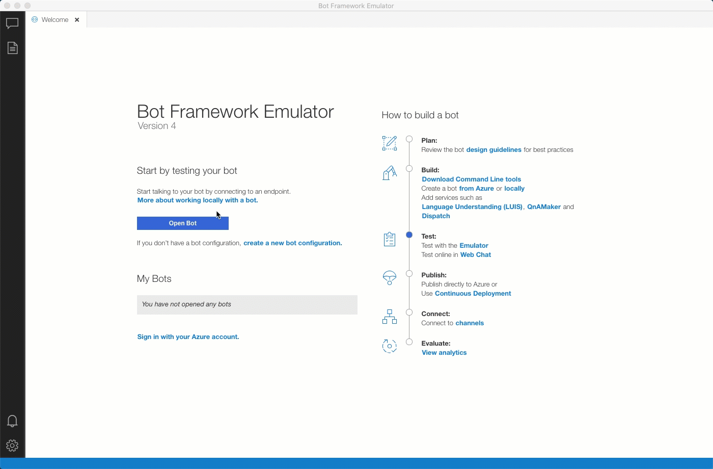

If you want to learn more about the Bot Framework emulator, go [here](https://docs.microsoft.com/en-us/azure/bot-service/bot-service-debug-emulator?view=azure-bot-service-4.0&tabs=csharp).

## ngrok

In order to hook this up to the Azure Bot Channel system, you need to expose your local endpoint.
You'll need something like [ngrok](https://ngrok.com) installed to create a tunnel from the internet to your
localhost.

On macOS you can install this using [Homebrew](https://brew.sh).

```shell
$ brew cask install ngrok
```

After installation, run `ngrok` to point to the default port of `3978` which the solution is configured for.
 
```shell
$ ngrok http -host-header=rewrite 3978
```

## Exposing the Bot in Azure

In Azure, you then need to set up the resource itself:

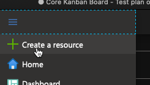

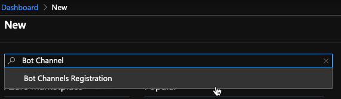


Once the resource is created, take the end point coming from your `ngrok` output (the https one)

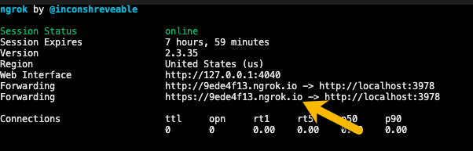

Append `/api/messages` to it and use it in the settings for the Bot Channel Registration
resource in the Azure Portal.

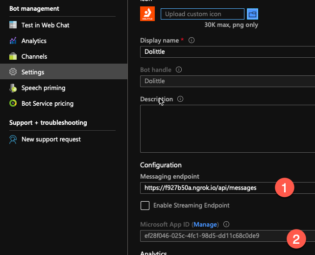

Jot down the `App Id` in the settings, as we'll need that later.
We'll also need a secret key for this to work, click the `manage` link
next to the `App Id`.

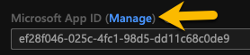

Create a client secret and make sure to copy the secret after you've done so
as its the last time you'll see it.

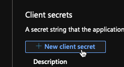

You're now ready to configure `The Aviator`.
Add a file called `.env` sitting in the [root folder](../../) of 'The Aviator' project.
Put the following information into it.

```ini
MicrosoftAppId=<APP ID FROM AZURE PORTAL>
MicrosoftAppPassword=<SECRET KEY FROM AZURE PORTAL>
```

Running `The Aviator` now will make it work with the Azure setup.

You're now ready to expose it to channels. You can test it directly from the Azure
portal or you can expose it to other channels - such as Teams.

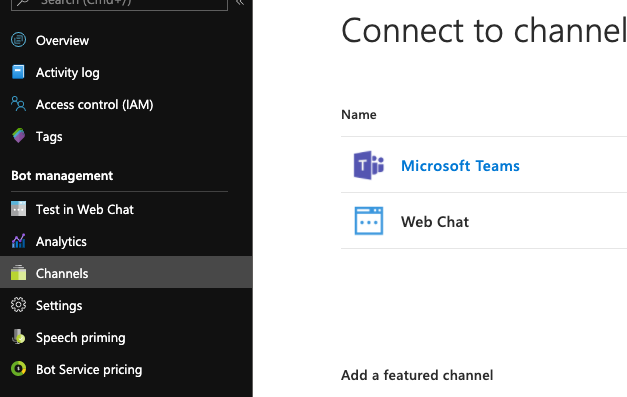

To test it using the Bot Framework Emulator, you can now enter the same URL as registered
in Azure and provide the `App-Id` and the secret as `Microsoft App Password`.

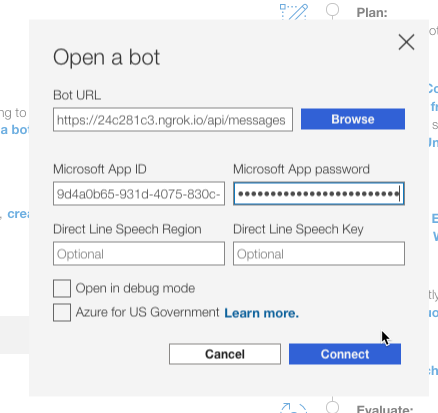

## Publishing to Teams

In the [manifest](./manifest) folder, you'll find the manifest that describes the bot
for Teams.

At the top of the file there is a `version` property. This needs to be unique for each
deployment and adhering to the [Semantic Versioning](https://semver.org).

```json
{
  "$schema": "https://developer.microsoft.com/en-us/json-schemas/teams/v1.5/MicrosoftTeams.schema.json",
  "manifestVersion": "1.5",
  "version": "1.0.3"
}
```

To deploy to Teams, you need to ZIP the manifest files into a single archive and upload.
Go to teams and fint the `Apps` button in the lower left:

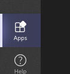

The use the `Upload a custom app` button.

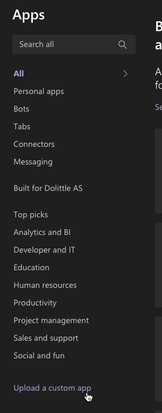

## Resources

| Resource | Description |
| -------- | ----------- |
| [Adaptive Cards](https://adaptivecards.io) | Used for presenting the test results |